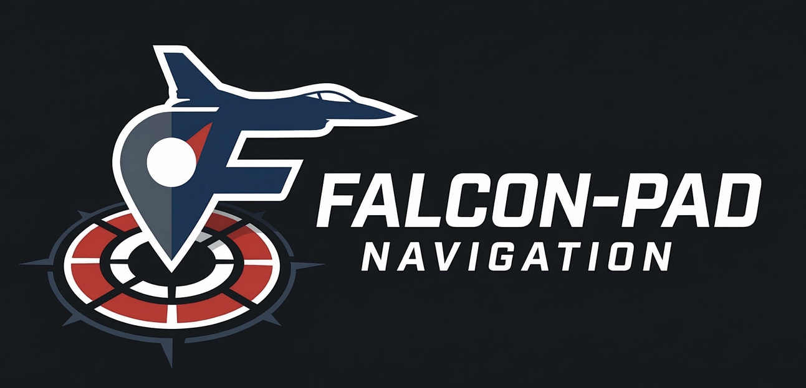

# 🛩️ FALCON-PAD v0.3

<p align="center">
  
</p>

<p align="center">
  Real-time tactical map for Falcon BMS 4.38 — PC + Tablet<br/>
  Carte tactique temps réel pour Falcon BMS 4.38 — PC + Tablette
</p>

---

## 🇬🇧 English

### Getting Started

1. Launch **Falcon-PAD.exe**
2. Open `http://localhost:8000` in your browser
3. On your tablet: open `http://YOUR_PC_IP:8000`
4. Start BMS and fly

### First Time Setup

**Windows Firewall** — allow tablet access:
```
netsh advfirewall firewall add rule name="Falcon-PAD" dir=in action=allow protocol=TCP localport=8000
```

**BMS Config** — add to `Falcon BMS User.cfg`:
```
set g_bTacviewRealTime 1
set g_bTacviewRealTimeHost 1
```

### Features

**Live Map** — aircraft position, heading, altitude and speed on a dark tactical map. Follow mode auto-tracks your aircraft. Compass button switches between North Up and Track Up.

**Mission Auto-Load** — automatically detects your DTC file (callsign.ini) from `User\Config` and displays steerpoints, flight plan, PPT threat circles and Bullseye on the map. Updates within 3 seconds when you modify your DTC.

**Datalink** — L16 contacts and TRTT/Tacview coalition aircraft displayed in real-time. Green = friendly, red = hostile.

**Kneeboard** — interactive ramp start checklist with progress tracking, 9-LINE CAS brief, brevity codes, COMMS frequencies, flight plan notes, and sticky map notes.

**Briefing** — upload and view PDF, images and Word documents directly in the app.

**Drawing Tools** — ruler for distance measurement, arrows, color picker, and tactical annotations.

**Tablet** — full touch support. The tablet auto-syncs mission data from your PC. Just bookmark the URL.

### Folder Structure

```
Falcon-PAD/
  Falcon-PAD.exe
  assets/
    logo_app.png
    logo_moyen.png
  logs/           ← created automatically
  briefing/       ← your briefing files
  config/         ← settings
```

---

## 🇫🇷 Français

### Démarrage

1. Lancer **Falcon-PAD.exe**
2. Ouvrir `http://localhost:8000` dans le navigateur
3. Sur la tablette : ouvrir `http://IP_DU_PC:8000`
4. Lancer BMS et voler

### Premier lancement

**Pare-feu Windows** — autoriser l'accès tablette :
```
netsh advfirewall firewall add rule name="Falcon-PAD" dir=in action=allow protocol=TCP localport=8000
```

**Config BMS** — ajouter dans `Falcon BMS User.cfg` :
```
set g_bTacviewRealTime 1
set g_bTacviewRealTimeHost 1
```

### Fonctionnalités

**Carte en direct** — position, cap, altitude et vitesse de l'avion sur une carte tactique sombre. Le mode suivi centre automatiquement l'avion. Le bouton boussole bascule entre Nord en haut et Track Up.

**Chargement auto de la mission** — détecte automatiquement votre fichier DTC (callsign.ini) dans `User\Config` et affiche les steerpoints, le plan de vol, les cercles de menace PPT et le Bullseye. Mise à jour en 3 secondes quand vous modifiez votre DTC.

**Datalink** — contacts L16 et avions de la coalition TRTT/Tacview en temps réel. Vert = allié, rouge = ennemi.

**Kneeboard** — checklist ramp start interactive avec suivi de progression, brief 9-LINE CAS, codes brevity, fréquences COMMS, notes de plan de vol et notes autocollantes sur la carte.

**Briefing** — upload et visualisation de PDF, images et documents Word directement dans l'application.

**Outils de dessin** — règle pour mesurer les distances, flèches, sélecteur de couleur et annotations tactiques.

**Tablette** — support tactile complet. La tablette synchronise automatiquement les données mission depuis le PC. Ajoutez simplement l'URL en favori.

---

<p align="center">
  by <strong>Riesu</strong> · <a href="https://www.falcon-charts.com">falcon-charts.com</a>
</p>
